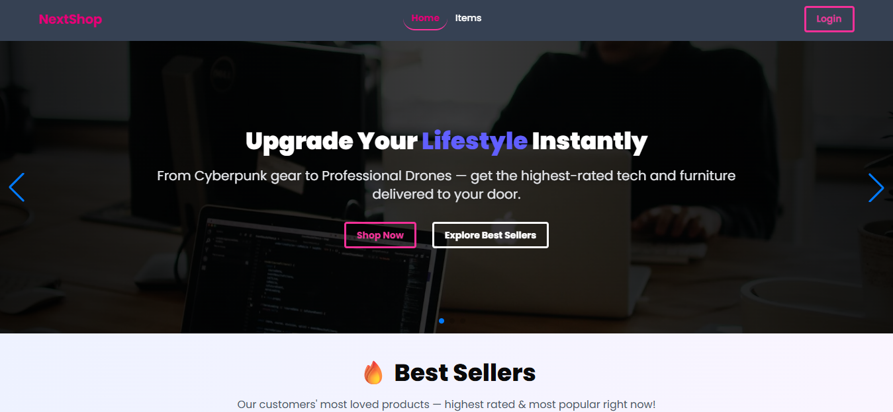

# 🛒 Next.js Item Management Application



A simple full-stack application built with **Next.js 15/16 (App Router)** and **Express.js API**.  
The project demonstrates public and protected routes, authentication, item listing, and item details with a clean UI.

---

## 🚀 Live Demo

🔗 Live Site: https://next-shop-web.vercel.app </br>
🔗 GitHub Repository: https://github.com/Reazul87/Next-Shop

---

<!-- ## 🔐 Login Credentials (Mock Login)
Email: `welcome@gmail.com`
Password: `Welcome123`

> You can also log in using **Google Authentication**.

--- -->

## 📌 Project Features

### 1️⃣ Landing Page (Public)

- Fully responsive landing page
- Includes **7 sections** (excluding Navbar & Footer)
- Navbar includes navigation links to Login and Items pages
- No authentication required

---

### 2️⃣ Authentication

- Implemented using **NextAuth.js**
- Supports:
  - Credentials login (email & password)
  - Google social login
- Authentication data stored securely in **HTTP-only cookies**
- On successful login, user is redirected to the Items page

---

### 3️⃣ Item List Page (Public)

- Publicly accessible
- Fetches items from **Express.js API**
- Displays:
  - Item name
  - Description
  - Price
  - Image
- Clean card-based UI

---

### 4️⃣ Item Details Page (Public)

- Displays full details of a selected item
- Dynamic route using item ID
- Server-side data fetching
- Graceful fallback for invalid or missing items

---

### 5️⃣ Protected Route: Add Item (Optional)

- Accessible **only to authenticated users**
- Protected using **Next.js middleware**
- Unauthenticated users are redirected to the login page
- Includes a form to add new items
- Item data is stored using the Express.js server

---

## 🔒 Route Protection Logic

Protected routes are implemented using **Next.js Middleware** and **NextAuth JWT tokens**.

### How it works:

1. User logs in → NextAuth sets a secure cookie
2. Middleware checks authentication status using the cookie
3. If user is not authenticated:
   - Redirected to `/login`
4. If authenticated:
   - Access to protected routes is granted

---

## 🗂️ Route Summary

| Route         | Type      | Authentication |
| ------------- | --------- | -------------- |
| `/`           | Public    | ❌             |
| `/login`      | Public    | ❌             |
| `/register`   | Public    | ❌             |
| `/items`      | Public    | ❌             |
| `/items/[id]` | Public    | ❌             |
| `/add-item`   | Protected | ✅             |

---

## 🛠️ Technologies Used

- **Next.js 15/16 (App Router)**
- **NextAuth.js**
- **Express.js**
- **MongoDB**
- **Tailwind CSS**
- **JWT & Cookies for Authentication**

---

## ⚙️ Setup & Installation

### 1️ Clone the repository

```bash
git clone https://github.com/Reazul87/Next-Shop.git
cd Next-Shop
```

### 2 Install dependencies

```
npm install

```

### 3️ Environment Variables

Create a .env.local file and add:

```

MONGO_URI=your_mongodb_uri_here
DB_NAME=Next_Shop

GOOGLE_CLIENT_ID=your_google_client_id
GOOGLE_CLIENT_SECRET=your_google_client_secret

NEXTAUTH_SECRET=your_next_auth_secret
NEXTAUTH_URL=your_next_auth_url

```

4️⃣ Run the development server

```
npm run dev

```

### 📖 Brief Explanation

This project demonstrates how to build a modern Next.js application with:

- Public and protected routes
- Cookie-based authentication
- Middleware route protection
- API integration with Express.js
- Clean UI using reusable components

## 🤝 Contributing

Contributions are welcome! Please feel free to submit a Pull Request.

### 📄 License

[](https://opensource.org/licenses/Apache-2.0)  
See the [LICENSE](LICENSE) file for details.

### 👨‍💻 Author

**MD. Reazul Hasan**  
[](https://github.com/Reazul87)

---

<!-- welcome@gmail.com Welcome123  -->
